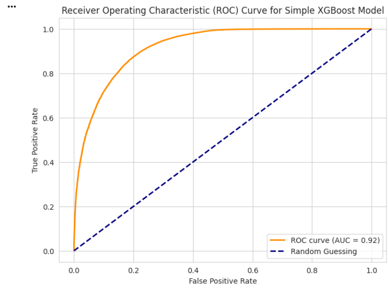

# Loan Payback Prediction Using Machine Learning

## Overview

This project develops and evaluates supervised machine learning models to predict whether a borrower will repay a loan.

The objective is to support credit risk assessment by identifying high-risk borrowers using classification techniques and model benchmarking.

---

## Business Problem

Financial institutions must evaluate borrower risk before approving loans. Poor risk assessment can result in financial loss due to defaults.

This project applies machine learning models to:

- Predict loan repayment likelihood
- Compare multiple classification algorithms
- Evaluate performance using ROC-AUC
- Improve predictive accuracy through model tuning and hybrid approaches

---

## Dataset

- Financial lending dataset (Kaggle-style structured data)
- Includes borrower financial and demographic features
- Target variable: Loan repayment status (binary classification)

---

## Tools & Technologies

- Python
- Pandas
- NumPy
- Scikit-learn
- XGBoost
- LightGBM
- Matplotlib / Seaborn

---

## Modeling Approach

### 1. Data Preparation
- Data cleaning
- Feature encoding
- Handling class imbalance
- Train/test split

### 2. Model Development
- Logistic Regression
- Random Forest
- XGBoost
- LightGBM
- Neural Network
- Hybrid / Stacked Models

### 3. Model Evaluation
- ROC Curve
- AUC Score
- Model comparison benchmarking

---

## Model Performance

### ROC Curve (XGBoost)

The tuned XGBoost model achieved an AUC of approximately **0.92**, indicating strong classification performance in distinguishing between repayment outcomes.

---

### Model Comparison (AUC Scores)

Hybrid and stacked models outperformed several individual baseline models, demonstrating the effectiveness of ensemble learning techniques for credit risk prediction.

---

## Repository Structure
